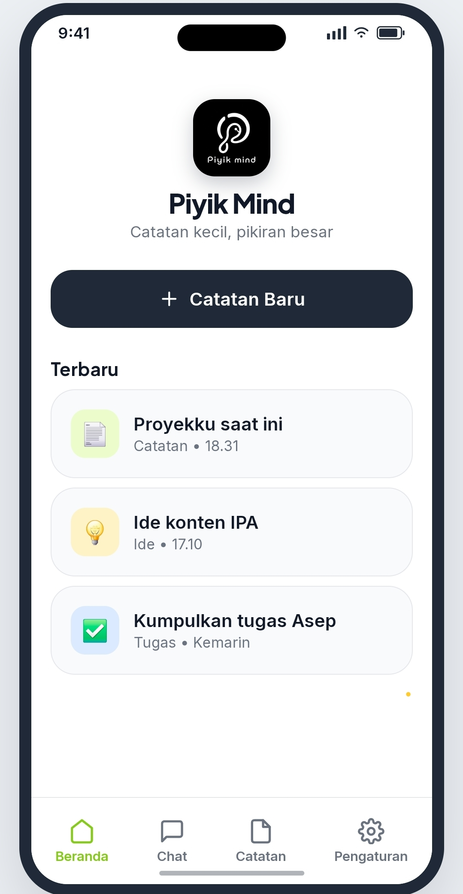
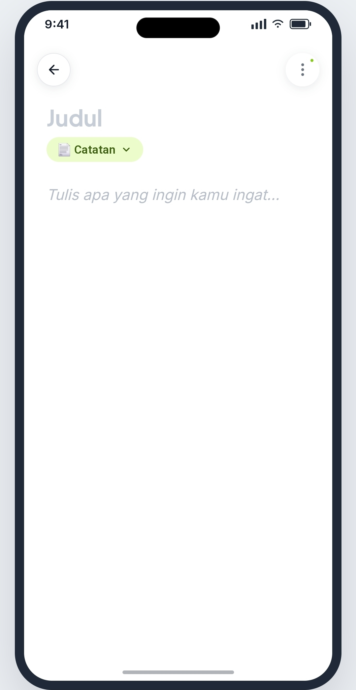
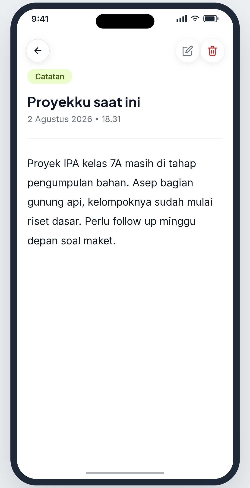

### Editor Catatan


### Chat


### Pengaturan


## Teknologi

- HTML, CSS, JavaScript (ES Module) — tanpa framework
- IndexedDB via Dexie.js
- Tidak ada backend, tidak ada server, tidak ada akun

## Menjalankan Secara Lokal

Karena aplikasi ini berjalan penuh di browser (ES Module), buka lewat local server, bukan lewat `file://` langsung:

```bash
# contoh pakai Python
python3 -m http.server 8885

# atau pakai Node
npx serve .
```

Lalu buka `http://localhost:8885` di browser.

## Struktur Proyek

```
src/
├── core/       # Database (Dexie) & utilitas inti
├── modules/    # Fitur-fitur aplikasi
├── shared/     # Komponen & helper
├── styles/     # CSS
├── assets/     # Icon & gambar
└── index.js    # Titik masuk aplikasi
```

## Status

**Versi saat ini: 1.1.0 (Agustus 2026)**

## Perubahan Terbaru (v1.1.0)

- ✨ Menambahkan splash screen.
- 🎨 Penyegaran tampilan antarmuka agar lebih modern dan elegan.
- ⚡ Meningkatkan pengalaman pengguna saat aplikasi dibuka.
- 🐞 Perbaikan bug dan peningkatan stabilitas.

## Lisensi

Copyright © 2026 M. Novi Irkhami

Piyik Mind merupakan perangkat lunak bebas yang didistribusikan di bawah **GNU General Public License v3.0 (GPL-3.0)**.

Lihat file [LICENSE](./LICENSE) untuk informasi lengkap.

---

Dibuat dengan ❤️ oleh **M. Novi Irkhami** — Angon Rasa